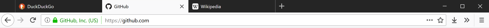

# FirefoxTweaks

This Github repository contains all the files I use to customize Firefox. This README also contains instructions on how to use them, as well as 

## userChrome.css
This file makes Firefox pleasantly black and white, like this:

It also only shows the close tab "X" on your currently selected tab, and when you mouse over a tab.

Place this file in your Firefox profile folder. [Don't know where to find that?](https://github.com/krathalan/FirefoxTweaks#where-is-my-firefox-profile-folder-located)

## Addons
### Decentraleyes
The simplest of these addons to use. Simply install it and let it do its thing. When a website requests a resource from a content delivery network (CDN), instead of letting the request go through, Decentraleyes serves the webpage a local version. Doing this increases loading speed as well as reduces the possibility of tracking.

### uBlock Origin
The next simplest of these addons to use. Simply install it and use the default lists if you don't want to configure it, but consider enabling more. Also make sure to check "Prevent WebRTC from leaking local IP addresses" in uBlock's settings.

### Cookie Autodelete
This addon will automatically delete cookies that aren't on your specified whitelist. The idea with this addon is to add a whitelist entry for every website you log into, so that you aren't logged out of any websites. At the same time, you aren't tracked by third-party domains or websites which you don't log into, but still visit. Note that this addon only stops tracking via cookies -- there are a multitude other ways companies can track you, which the next addon, uMatrix, will (mostly) take care of.

If you would like to import my whitelist, download and import the Cookie_AutoDelete_2.X.X_Expressions.json file in this repository. Note that this whitelist is personal to me, so it probably won't cover every website you would like it to. Some configuration is still required.

### uMatrix
uMatrix blocks almost everything (cookies, media, scripts, frames, and more) by default that isn't third-party. It's the most complicated addon here to use. If you're not interested in performing additional steps when you go to a website for the first time, don't install this addon.

uMatrix allows the first-party domain to do whatever it wants. If you visit twitch.tv with uMatrix installed, it doesn't block anything from twitch.tv. But it'll block everything from domains which twitch.tv tries to connect to, which, as of the time of this writing, include:

- gstatic.com
- ttvnw.net
- twitchcdn.net
- twitchsvc.net
- 0914.global.ssl.fastly.net
- imasdk.googleapis.com
- jtvnw.net
- summerhamster.com
- amazon-adsystem.com
- doubleclick.net
- krxd.net
- googleanalytics.com
- mixpanel.com
- quantserve.com
- scorecardresearch.com

That's ridiculous! I only wanted to go to Twitch. What is fastly.net? What is jtvnw.net? summerhamster.com? I don't know what any of those domains do or who they're controlled by, and you're letting them into your browser -- unless you have uMatrix installed.

Of course, uMatrix is likely to break most sites. It definitely breaks twitch.tv, but you can re-enable domains selectively, on a per-domain basis. For example, if I enabled twitchcdn.net on twitch.tv, and then I went to some other website that tried to connect to twitchcdn.net, it wouldn't be allowed because only twitch.tv is allowed to connect to that domain.

Continuing the twitch.tv example, I have the following domains enabled on twitch.tv:

- ttvnw.net
- twitchcdn.net
- twitchsvc.net

I also have gstatic.com enabled globally. That's only 4 of the 15 (!!!) domains that twitch.tv tries to connect to. So if twitch.tv works with only 4 of the 15 domains, why should I enable the others? I don't trust them because I don't even know what most of them are. 

So how did I know that those domains would un-break twitch.tv? Well, I didn't. It's a guessing game. I guessed that since twitchcdn.net and twitchsvc.net both have "twitch" in their names, that they were probably owned by twitch.tv and I could probably afford them the same level of trust, so I enabled them. That still didn't un-break twitch.tv, so the next best guess I had was to enable ttvnw.net. And voila! It works now. To save your changes, click the padlock icon in uMatrix. 

Now whenever I visit twitch.tv again, it'll work and I don't have to mess with uMatrix anymore. As long as you save your changes with the padlock, you only have to configure a website once.

If you would like to use my uMatrix whitelist, download and import the my-umatrix-rules.txt file in this repository. My uMatrix whitelist is fairly relaxed. Just like the Cookie Autodelete whitelist, mine is personal to me and what I want the websites to visit to do, so you'll probably have to still do some amount of configuration.

## user.js
This file makes a bunch of tweaks to Firefox, like in about:config. The goal was to reduce ways that websites can track you, but still not sacrifice (almost) anything to achieve that. Note that at the bottom of the file, I've included several tweaks which enable telemetry, but they're commented out by default. If you wish to enable telemetry, uncomment the lines. 

Place this file in your Firefox profile folder. [Don't know where to find that?](https://github.com/krathalan/FirefoxTweaks#where-is-my-firefox-profile-folder-located)

### List of tweaks:

#### Disable web notifications 
`dom.webnotifications.enabled` = `false`

Can't be used to track you, but is annoying.

#### Disallow websites from accessing your location
`geo.enabled` = `false`

#### Disallow websites from enumerating your connected USB devices
`dom.gamepad.enabled` = `false`

#### Disable prefetching of certain URLS 
`network.prefetch-next` = `false`

More information can be found [here](http://kb.mozillazine.org/Network.prefetch-next).

#### Update addons automatically 
`extensions.update.enabled` = `true` 

This should be set to `true` by default.

#### Check for and install Firefox updates 
`app.update.enabled` = `true`

This should be set to `true` by default.

#### Disable Firefox Tracking Protection
`privacy.trackingprotection.enabled` = `false`

`privacy.trackingprotection.pbmode.enabled` = `false`

Use uMatrix/uBlock instead.

#### Disable the Firefox password manager 
`signon.rememberSignons` = `false`

Use [KeePass](https://keepass.info/) instead.

#### Disable the Firefox autofill 
`browser.formfill.enable` = `false`

#### Restrict cookies, cache, etc. to the domain level 
`privacy.firstparty.isolate` = `true`

More information can be found [here](https://www.bleepingcomputer.com/news/software/another-tor-browser-feature-makes-it-into-firefox-first-party-isolation/).

#### Disable third party cookies 
`network.cookie.cookieBehavior` = `1`

#### Disable Pocket
`browser.pocket.enabled` = `false` 

`extensions.pocket.enabled` = `false`

####  Disallow websites from viewing your microphone and camera status 
`media.navigator.enabled` = `false` 

#### Disallow websites from viewing your computer's battery status
`dom.battery.enabled` = `false`

#### Make scrolling feel better 
`general.smoothScroll.currentVelocityWeighting` = `0`

`general.smoothScroll.mouseWheel.durationMaxMS` = `250`

`general.smoothScroll.stopDecelerationWeighting` = `0.82`

`mousewheel.min_line_scroll_amount` = `40`

#### Decrease full screen video fade 
`full-screen-api.transition-duration.enter` = `50 0` 

`full-screen-api.transition-duration.leave` = `0 50` 

## Frequently asked questions
### Where is my Firefox profile folder located?

You can find it in the following locations:

OS | Path
----- | -----
Windows | `C:\Users\(your username)\AppData\Roaming\Mozilla\Firefox\Profiles\(random string).default\`
OS X | `Users/(your username)/Library/Application Support/Firefox/Profiles/(random string).default`
Linux | `home/(your username)/.mozilla/firefox/(random string).default`
