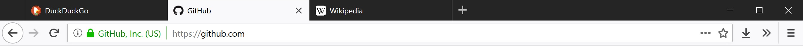

# Firefox Tweaks

This Github repository contains all the files I use to customize Firefox. This README also contains instructions on how to use them, as well as the list of addons I use and how to use them.

## Addons
### Decentraleyes
The simplest of these addons to use. Simply install it and let it do its thing. When a website requests a resource from a content delivery network (CDN), instead of letting the request go through, Decentraleyes serves the webpage a local version. Doing this increases loading speed as well as reduces the possibility of tracking.

[Source code](https://github.com/Synzvato/decentraleyes) / [Install here](https://addons.mozilla.org/en-US/firefox/addon/decentraleyes/)

### uBlock Origin
The next simplest of these addons to use. Simply install it and use the default lists if you don't want to configure it, but consider enabling more. Also make sure to check "Prevent WebRTC from leaking local IP addresses" in uBlock's settings.

[Source code](https://github.com/gorhill/uBlock) / [Install here](https://addons.mozilla.org/en-US/firefox/addon/ublock-origin/)

### Cookie Autodelete
This addon will automatically delete cookies that aren't on your specified whitelist. The idea with this addon is to add a whitelist entry for every website you log into, so that you aren't logged out of any websites. At the same time, you aren't tracked by third-party domains or websites which you don't log into, but still visit. Note that this addon only stops tracking via cookies -- there are a multitude other ways companies can track you, which the next addon, uMatrix, will (mostly) take care of.

If you would like to import my whitelist, download and import the `Cookie_AutoDelete_2.X.X_Expressions.json` file in this repository. For a list of websites you'll stay logged into with that list, check [here](https://github.com/krathalan/FirefoxTweaks/blob/master/Cookie_AutoDelete_accounts.md).

[Source code](https://github.com/Cookie-AutoDelete/Cookie-AutoDelete) / [Install here](https://addons.mozilla.org/en-US/firefox/addon/cookie-autodelete/)

### uMatrix
uMatrix blocks almost everything (cookies, media, scripts, frames, and more) by default that isn't third-party. It's the most complicated addon here to use. If you're not interested in performing additional steps when you go to a website for the first time, don't install this addon.

uMatrix allows the first-party domain to do whatever it wants. If you visit twitch.tv with uMatrix installed, it doesn't block anything from twitch.tv. But it'll block everything from domains which twitch.tv tries to connect to, which, as of the time of this writing, include:

- gstatic.com
- ttvnw.net
- twitchcdn.net
- twitchsvc.net
- 0914.global.ssl.fastly.net
- imasdk.googleapis.com
- jtvnw.net
- summerhamster.com
- amazon-adsystem.com
- doubleclick.net
- krxd.net
- googleanalytics.com
- mixpanel.com
- quantserve.com
- scorecardresearch.com

That's ridiculous! I only wanted to go to Twitch. What is fastly.net? What is jtvnw.net? summerhamster.com? I don't know what any of those domains do or who they're controlled by, and I'm letting them into my browser -- unless I have uMatrix installed.

Of course, uMatrix is likely to break most sites. It definitely breaks twitch.tv, but you can re-enable domains selectively, on a per-domain basis. For example, if I enabled twitchcdn.net on twitch.tv, and then I went to some other website that tried to connect to twitchcdn.net, it wouldn't be allowed because only twitch.tv is allowed to connect to that domain.

Continuing the twitch.tv example, I have the following domains enabled on twitch.tv:

- ttvnw.net
- twitchcdn.net
- twitchsvc.net

I also have gstatic.com enabled globally. That's only 4 of the 15 (!!!) domains that twitch.tv tries to connect to. So if twitch.tv works with only 4 of the 15 domains, why should I enable the others? I don't trust them because I don't even know what most of them are. 

So how did I know that those domains would un-break twitch.tv? Well, I didn't. It's a guessing game. I guessed that since twitchcdn.net and twitchsvc.net both have "twitch" in their names, that they were probably owned by twitch.tv and I could probably afford them the same level of trust, so I enabled them. That still didn't un-break twitch.tv, so the next best guess I had was to enable ttvnw.net. And voila! It works now. To save your changes, click the padlock icon in uMatrix. 

Now whenever I visit twitch.tv again, it'll work and I don't have to mess with uMatrix anymore. As long as you save your changes with the padlock, you only have to configure a website once.

If you would like to use my uMatrix whitelist, download and import the `my-umatrix-rules.txt` file in this repository. For a list of websites and services that this file fixes, check [here](https://github.com/krathalan/FirefoxTweaks/blob/master/uMatrix_rules_fixed_sites.md).

[Source code](https://github.com/gorhill/uMatrix) / [Install here](https://addons.mozilla.org/en-US/firefox/addon/umatrix/)

## user.js
This file makes a bunch of tweaks to Firefox, like in about:config. The goal was to reduce ways that websites can track you, but still not sacrifice (almost) anything to achieve that. At the bottom of the file, I've included several tweaks which enable or disable telemetry, but they're all commented out by default. If you wish to enable or disable telemetry, uncomment the respective section. Note that some telemetry is enabled in a default Firefox installation.

Place this file in your Firefox profile folder. [Don't know where to find that?](https://github.com/krathalan/FirefoxTweaks#where-is-my-firefox-profile-folder-located)

If you would like a full list of the tweaks made along with an explanation for each one, that list can be found [here](https://github.com/krathalan/FirefoxTweaks/blob/master/ListOfTweaks.md).

## userChrome.css
This file makes Firefox pleasantly black and white, like this:

It also only shows the close tab "X" on your currently selected tab, and when you mouse over a tab.

Place this file in your Firefox profile folder. [Don't know where to find that?](https://github.com/krathalan/FirefoxTweaks#where-is-my-firefox-profile-folder-located)

## Frequently asked questions
### Where is my Firefox profile folder located?

You can find it in the following locations:

OS | Path
----- | -----
Windows | `C:\Users\(your username)\AppData\Roaming\Mozilla\Firefox\Profiles\(random string).default\`
OS X | `Users/(your username)/Library/Application Support/Firefox/Profiles/(random string).default`
Linux | `home/(your username)/.mozilla/firefox/(random string).default`

### Why did you include X tweak but not Y tweak?
The goal of my user.js file was to increase privacy while at the same time not sacrificing much to achieve that. The only browser features that are taken away are Pocket, notifications, geolocation, the password manager, and autofill. I think most people don't use web notifications or Pocket, geolocation isn't needed on desktops/laptops, the password manager is better to replace with KeePass, and autofill isn't needed. This is just what I think though, so of course you can choose to comment out certain lines in the user.js file.

The reason some other tweaks weren't included was because I felt they were either sacrificing too much (i.e. could possibly break some websites) or they were subjective (e.g. disabling the activity stream on the new tab page).

### Why did you enable/disable telemetry in user.js?
I didn't. Both an enable and disable telemetry section are there, commented out. The intention is that you will uncomment which section you prefer. If you want to enable or disable telemetry, uncomment the respective section.

## License
This repository is licensed under GPLv3. You may use it for commercial purposes, modify it, distribute it or any modified works, but I am not liable for any damage caused by it and it comes with no warranty. If you choose to distribute it or any modified versions, a copy of the GPLv3 and a copyright notice must be included in your distributed version, changes made must be documented, you must make the source code available, and modifications must be released under the same license.

The exceptions to this are: 
- user.js, which is provided under the MIT license with a copyright notice
- userChrome.css, which is provided under the GPLv3 with a copyright notice

## Sources
This repository draws from other people's work, listed below:
- [Pyllyukko's user.js](https://github.com/pyllyukko/user.js)
- [Timvde's UserChrome-Tweaks](https://github.com/Timvde/UserChrome-Tweaks)
- [PrivacyTools](https://www.privacytools.io/)
